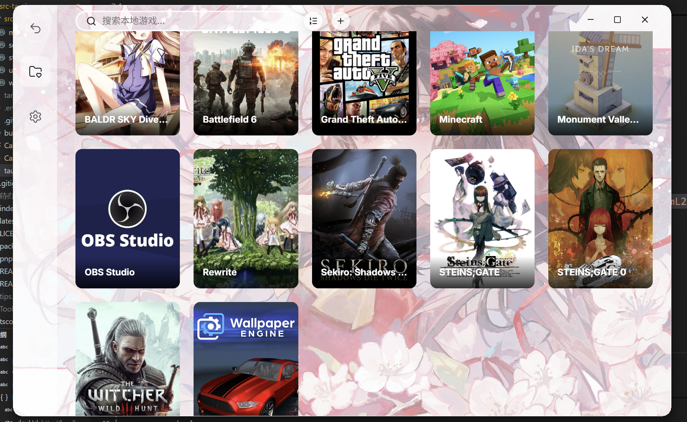
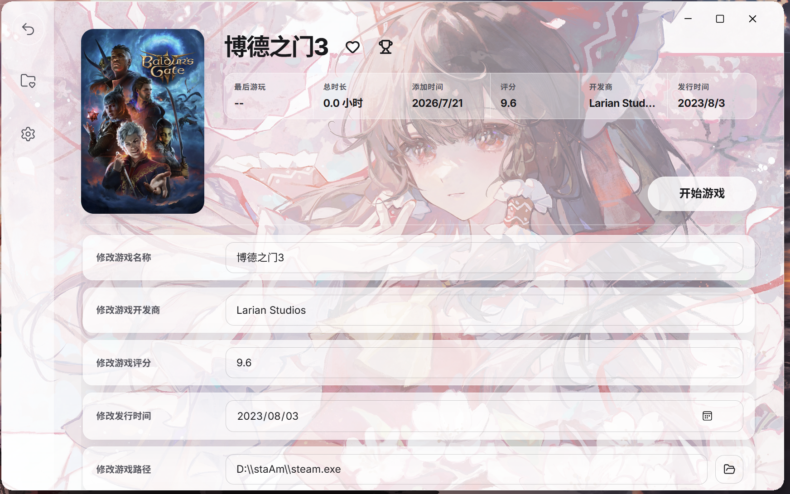

# Quelplan

[中文](README.md) | [English](README_EN.md)

> **BETA**: Quelplan is still in testing. Features, interfaces, and the local data format may change. Export and back up your data regularly.

Quelplan is a local game library manager and launcher for Windows. It helps you organize games, retrieve game information, track playtime, and launch local or Steam games from one place.

## Screenshots

### Game Library



### Game Details



## Features

- Add individual games, scan directories in batches, or import a Steam library.
- Retrieve game information and covers from BGM, VNDB, and IGDB.
- Browse, search, and sort the local game library.
- Edit game names, developers, scores, release dates, executable paths, and covers.
- Mark games as favorites or completed, and track total playtime and activity from the last seven days.
- Launch local or Steam games and configure an ordered launch chain of up to three games or applications.
- Use Chinese or English, follow the system/light/dark theme, and choose custom backgrounds.
- Use the system tray, start on boot, hide after launching a game, close to tray, and receive automatic updates.
- Import and export local data.

## Tech Stack

- Desktop framework: Tauri 2
- Frontend: React 19, TypeScript, Vite
- Backend: Rust, Tokio, Reqwest
- Data storage: local storage based on Serde, Bincode, and WAL
- Package manager: pnpm

## Local Development

### Requirements

- Node.js LTS
- pnpm 10
- Rust stable
- [Tauri 2 prerequisites for Windows](https://v2.tauri.app/start/prerequisites/)

### Run and Build

```powershell
pnpm install
pnpm tauri dev
pnpm tauri build
```

## TODO

- Add Epic Games library import.
- Redesign the settings interface with reset-to-default controls, version information, manual update checks, and clearer token and authorization status.
- Add filters for favorite and completed games.
- Detect duplicate games.
- Improve backup and restore reliability and data migration compatibility between future versions.

## License

This project is open source under the [MIT License](LICENSE).
